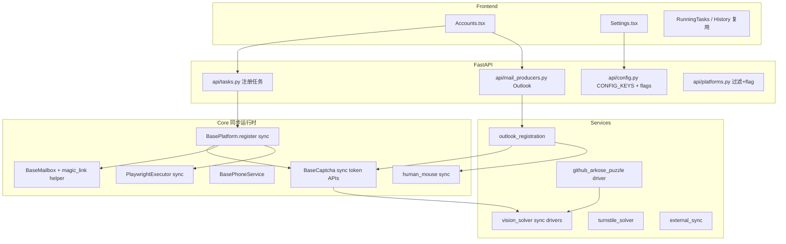

# reg-factory 注册与验证码能力集成设计

| 字段 | 值 |
|------|-----|
| 文档标题 | reg-factory → any-auto-register 集成设计 |
| 作者 | TBD |
| 日期 | 2026-07-26 |
| 状态 | Draft（评审修订 R2 + 用户决策 R3） |
| 源仓库 | `F:\git\reg-factory` @ `443b9dd` (`443b9ddd0beabb1fc5e65765504ecfd84dc30112`) |
| 目标仓库 | `F:\git\any-auto-register` @ `1c12958`（评审时） |
| 相关上游 | https://github.com/highkay/reg-factory |

---

## Overview

`reg-factory` 是一套以 **BitBrowser/AdsPower 指纹浏览器 + Clash Verge 节点切换 + 单体脚本** 为核心的注册流水线，覆盖 Outlook 自注册、Claude/ChatGPT/Grok/GitHub 注册，以及一套较完整的 **视觉多模型投票验证码**（`vision_solver/` + `common/agent_captcha.py`）和 **FunCaptcha / PerimeterX** 第三方打码集成。

`any-auto-register` 已经是一个 **可插拔平台插件 + 任务编排 + 邮箱工厂 + 外部回填** 的系统：平台走 `platforms/*/plugin.py` + `@register`，任务走 `api/tasks.py`（`ThreadPoolExecutor` + 同步 `register()`），验证码走 `core/base_captcha.py`，邮箱走 `core/base_mailbox.py::create_mailbox()`。浏览器栈为 **同步 Playwright/Patchright**（`core/executors/playwright.py`、`browser_backend.sync_playwright()`），与 reg-factory 的 **async Playwright** 不同。

本设计的核心结论：

1. **不要整仓搬迁** reg-factory 的 5k+ 行单体脚本与指纹浏览器硬依赖。
2. **按能力切片** 把可复用算法沉淀到 any-auto-register 的现有抽象层。
3. **运行时统一为同步 Playwright**（方案 A）：vision drivers 与 human_mouse 移植时改写为 sync API，禁止在 worker 线程里 `asyncio.run` 嵌套调用 async solvers。
4. **优先补齐验证码与 magic-link 邮箱 helper**，再以更薄的垂直切片接入 Claude / Outlook 生产者 / GitHub。
5. Gemini / Google One 在源侧仍是 README 营销，**无实质可移植实现**。
6. **许可门禁**：在复制 `vision_solver` / 移植 mouse 轨迹算法之前，必须完成书面法务决策（见 Key Decisions）。

---

## Background & Motivation

### 当前状态：reg-factory（源）

实测 / 复核规模（`443b9dd`；包级行数因是否计入非 py/ts 资产会浮动）：

| 模块 | 规模 | 职责 |
|------|------|------|
| `register.py` | ~5362 行 | Claude 主流程 + Outlook legacy + FunCaptcha/PX + 接码 + hCaptcha 视觉 |
| `register_outlook_standalone.py` | ~2574 行 | 独立 Outlook 注册（CapSolver/EZCaptcha Arkose + PerimeterX + Graph token） |
| `register_chatgpt.py` | ~1570 行 | ChatGPT 浏览器注册 + Clash 节点 + Turnstile + Codex 导出 |
| `register_grok.py` | ~1362 行 | Grok 浏览器注册 + Turnstile 多 solver |
| `register_grok_http.py` | ~411 行 | Grok 协议注册，依赖 vendored `xconsole_client/` |
| `register_github.py` | ~635 行 | GitHub 注册 + Arkose FunCaptcha + **`agent_captcha.solve_puzzle_voting`** |
| `common/agent_captcha.py` | ~738 行 | 多模型投票内核 + **GitHub Arkose 拼图专用驱动**（非通用 arkose_match preset） |
| `vision_solver/` | ~1693–1758 行 | 通用 CaptchaSpec + 4 种交互范式 driver（**async** Playwright） |
| `xconsole_client/` | ~4377–4384 行 | x.ai gRPC-web 协议客户端（vendored from grokcli-2api） |
| `gmail_android/` | ~3700–4300 行 | BlueStacks + Appium Gmail 注册 |
| `codex_k12/` | ~32k–43k 行 | 独立 Vue/TS 运营控制台，与主 Python 流水线隔离 |
| `bitbrowser.py` / `adspower.py` | ~154+344 行 | 指纹浏览器本地 API 封装 |
| `common/proxy_switch.py` | ~153 行 | Clash Verge 节点切换 |
| `common/human_mouse.py` | ~227 行 | WindMouse + OU 震颤（**async** `page.mouse.*`）；header 注明 spirit from LoseNine/ruyipage |

架构特征：

- **脚本即产品**：每个平台一个顶层脚本，CLI / WebUI 起子进程。
- **强外部运行时依赖**：BitBrowser/AdsPower；Clash Verge External Controller。
- **验证码能力分散**：FunCaptcha 逻辑在多个 register 脚本中复制。
- **视觉有两套相关代码**：
  - `vision_solver/`：通用 CaptchaSpec（Claude hCaptcha canvas 等）。
  - `agent_captcha.solve_puzzle_voting`：GitHub 实测路径（variant / SKIP_VARIANT / 多轮）。
- **许可**：仓库根目录 **无 LICENSE 文件**；README badge 为 `license-educational`。

### 当前状态：any-auto-register（目标）

| 层 | 关键入口 | 现状 |
|----|----------|------|
| 平台插件 | `core/base_platform.py`, `core/registry.py`, `platforms/*` | chatgpt, cursor, grok, kiro, qwen, tavily, trae, openblocklabs, deepseek, cerebras, nvidia, zai |
| 任务编排 | `api/tasks.py::_run_register()` | 后台线程 + `ThreadPoolExecutor`；`RegisterTaskControl` stop/skip；`TaskRunModel` 持久化 |
| 验证码 | `core/base_captcha.py`（~592 行） | Turnstile / hCaptcha / reCAPTCHA v2 / image / classify_hcaptcha / aliyun / turnstile_session；**同步** + `interrupt_checker` |
| 邮箱 | `core/base_mailbox.py` | 20+ provider；`wait_for_code` 的 `_safe_extract` **会剥离 `https?://` URL** |
| Magic-link 先例 | `platforms/cerebras/plugin.py`、`platforms/zai/plugin.py` | 自定义 regex + 私有 list 钩子（Cerebras 仅 `_get_mails`≈CFWorker；Z.ai 另有 `_get_client().get_messages`）；**不走** `wait_for_code`；**非**全 provider 通用 |
| 接码 | `core/base_phone.py` | **HeroSMS / FreeSmsTool / FiveSim**（工厂由 ChatGPT phone 模块 `resolve_phone_verification_provider` 等组装） |
| SMSToMe | `platforms/chatgpt/phone_service.py` + `smstome_tool.py` | **ChatGPT 专用抓取**，不是通用 `BasePhoneService` |
| 浏览器 | `core/executors/playwright.py`, `browser_backend` | **sync** Playwright/Patchright/Camoufox |
| 外部回填 | `services/external_sync.py` | chatgpt/cpa/sub2api、grok、kiro、qwen、ds2api、zai2api 等 |
| 配置 | `api/config.py::CONFIG_KEYS` + Settings + Accounts | **无**现成 feature-flag 框架；`GET /api/config` **明文返回**全部配置（含密钥），前端仅用 `secret: true` 遮罩输入框 |
| Outlook 资产 | `OutlookAccountModel` + `OutlookMailbox` | 本地池 Graph/IMAP 收信；**无自注册** |

痛点：

1. 缺少 Claude、GitHub、Outlook **自注册**。
2. 无 FunCaptcha/PerimeterX 抽象；无本地多模型视觉 page 驱动。
3. Outlook 只作为收信源，不能自产邮箱。
4. 直接复制 async 脚本会与 `ThreadPoolExecutor` + sync Playwright 冲突。

### 动机

在不破坏现有 chatgpt/grok/qwen 主链路的前提下，把 reg-factory 中已验证的注册算法与验证码能力映射到插件架构，形成可配置、可观测、可增量合入的路线图。

---

## Goals & Non-Goals

### Goals

1. 能力缺口矩阵与 P0/P1/P2 优先级。
2. 验证码层扩展：FunCaptcha、PerimeterX、Vision multi-vote、多 solver 后端；**同步运行时契约**。
3. Magic-link 邮箱提取与 Claude/GitHub/Outlook 生产者的可实现规格。
4. 从单体脚本到插件的移植方法与 **porting map**。
5. Feature flag 机制、任务运行时、依赖、风险、分片 PR。

### Non-Goals

1. 本阶段不写生产实现代码、不改默认行为。
2. 不把 BitBrowser / AdsPower / Clash Verge 设为硬依赖。
3. 不移植 `codex_k12/`、reg-factory `webui/`。
4. 不承诺 Gemini / Google One。
5. P0 不引入 Gmail Android 全栈。
6. **不为历史 `RegisterTaskPage.tsx` 做完整 UI 对等**（仅在配置清单中注明“可选遗留检查”；默认 UI 以 Accounts/Settings 为准）。
7. 不在无书面法务结论前合入大段 vendored 源码（PR 门禁）。

---

## Gap Analysis（reg-factory vs any-auto-register）

### 能力清单矩阵

图例：**已有** / **部分重叠** / **需移植** / **不建议移植**

| 能力 | reg-factory 位置 | any-auto-register 现状 | 判定 | 建议 |
|------|------------------|------------------------|------|------|
| ChatGPT 注册 | `register_chatgpt.py` | `platforms/chatgpt/*` | **部分重叠** | 仅吸收可验证改进 |
| Grok 浏览器/协议 | `register_grok*.py` + xconsole | `platforms/grok/*` + 同会话 Turnstile | **部分重叠** | 保留本仓库实现；可选额外 turnstile fallback |
| Claude 注册 | `register.py` | **无** | **需移植** | `platforms/claude/`（薄切片） |
| Claude magic-link 收信 | Graph/浏览器读信 | `wait_for_code` **剥 URL**；Cerebras 有正确先例 | **需移植** | 共享 magic-link poller |
| GitHub 注册 | `register_github.py` | **无** | **需移植** | `platforms/github/` |
| GitHub 视觉拼图 | **`agent_captcha.solve_puzzle_voting`** | **无** | **需移植** | 独立 driver；**不能**仅靠 `arkose_match.json` |
| Outlook 自注册 | `register_outlook_standalone.py` | 仅收信/导入 | **需移植** | 邮箱生产者服务 |
| FunCaptcha token | 多脚本复制 | **无** | **需移植** | `BaseCaptcha.solve_funcaptcha` |
| PerimeterX | CapSolver/EZ + human hold | **无** | **需移植** | token 路径 + sync human_mouse |
| hCaptcha 视觉 canvas | `vision_solver` + Claude | 仅云端 classify / token | **需移植** | sync port `services/vision_solver/` |
| YesCaptcha 基础 | 多处 | `YesCaptcha` 完整 | **已有** | 复用 |
| 同会话 Turnstile | 无同等抽象 | `solve_turnstile_session` | **已有(更优)** | 保持 |
| 临时邮箱多 provider | `common/temp_email.py` | `create_mailbox` 更强 | **已有** | 复用 |
| 接码 HeroSMS 等 | `common/sms.py` | `BasePhoneService`：hero/five_sim/free_sms_tool | **已有(更规范)** | Claude 走此路径；**SMSToMe 非通用** |
| BitBrowser/AdsPower | bit/ads 客户端 | Playwright 栈 | **不建议移植** | 可选 adapter 永不硬依赖 |
| Clash Verge | `proxy_switch.py` | 代理池 | **不建议移植** | — |
| codex_k12 / WebUI | 独立产品 | 自有前端 | **不建议移植** | — |
| Gemini / Google One | README only | **无** | **不建议移植** | 无源码 |
| 教育许可下的大段复制 | README educational | 本仓许可亦模糊 | **风险** | 法务门禁 + clean-room 优先 |

### 复杂度结论

- Claude 有效逻辑约 1.5–2k 行（magic-link + hCaptcha + onboarding），但与 Outlook/接码混在 5k 行文件中。
- GitHub 视觉成功路径依赖 `solve_puzzle_voting`，不是 `vision_solver/presets/arkose_match.json` 单独能覆盖。
- `vision_solver` 与 `agent_captcha` 共享投票思想但驱动不同；移植时要拆清。

---

## Proposed Design

### 目标架构



### 0) Runtime Bridge（阻塞决策：方案 A）

**选定方案 A：同步移植。**

| 方案 | 描述 | 结论 |
|------|------|------|
| **A. Sync port（选定）** | vision drivers / human_mouse 的 page I/O 改为 sync Playwright；vote HTTP 保持 sync `requests`/`httpx` | **P0 采用** |
| B. Async island | 保留 async solvers，平台用 `asyncio.run()` 或 thread-local loop | 拒绝作默认：worker 线程内嵌套 loop、与已有 sync page 对象不兼容 |
| C. 新 async executor | 全链路 async | 范围过大，非 P0 |

约束：

1. 新平台 `register()` **必须同步**，与 Grok/Cerebras/NVIDIA 一致，跑在 `ThreadPoolExecutor` worker 中。
2. **禁止** `BaseCaptcha` 上出现 `async def` 方法；page 驱动入口为：
   - `services.vision_solver.solve_on_page(page, spec, *, interrupt_checker=None) -> bool`（**sync**）
   - 平台直接调用 service，而不是 `await captcha.solve_vision_on_page`
3. `human_mouse`：
   - `windmouse_path` / `tremor_offsets`：纯计算，sync
   - `human_move_to(page, x, y)` / `human_press_and_hold(page, ...)`：`page.mouse.move/down/up` + `time.sleep`，sync
4. `interrupt_checker`：在 sleep 循环与 vote 等待中每 ≤0.5s 调用一次，绑定 `RegisterTaskControl.checkpoint`。
5. 浏览器后端：Claude/GitHub/Outlook 默认 **Patchright/Chromium via 现有 browser_backend**（与 NVIDIA/Grok headed 一致）；Camoufox 仅作可配置实验，P0 不强制。

### 1) 验证码目标架构

#### 1.1 扩展 `BaseCaptcha`（全部同步）

```python
class BaseCaptcha(ABC):
    # 已有 abstract: solve_turnstile / solve_hcaptcha / solve_recaptcha_v2 / solve_image
    # 已有 optional: solve_turnstile_session / classify_hcaptcha / solve_aliyun*

    def solve_funcaptcha(
        self,
        page_url: str,
        public_key: str,
        *,
        subdomain: str | None = None,
        blob: str | None = None,
        proxy: str | None = None,
        timeout_seconds: float | None = None,
        interrupt_checker=None,
        **kwargs,
    ) -> str:
        """Arkose/FunCaptcha token。"""
        raise NotImplementedError

    def solve_perimeterx(
        self,
        page_url: str,
        app_id: str,
        *,
        proxy: str | None = None,
        timeout_seconds: float | None = None,
        interrupt_checker=None,
        **kwargs,
    ) -> "PerimeterXSolution":
        """见下方返回类型约定。"""
        raise NotImplementedError

    def solve_vision_challenge(
        self,
        *,
        prompt: str,
        image_b64: str | None = None,
        images_b64: list[str] | None = None,
        answer_format: str = "ANSWER_INDEX",
        n_options: int | None = None,
        timeout_seconds: float | None = None,
        interrupt_checker=None,
        **kwargs,
    ) -> dict:
        """多模型投票：{answer, votes, raw_texts, model_used}。无 page 交互。"""
        raise NotImplementedError
```

**不**把 `solve_vision_on_page` 放进 `BaseCaptcha`。页面驱动放在：

```python
# services/vision_solver/solver.py
def solve_on_page(page, spec, *, shot_dir=None, interrupt_checker=None) -> bool: ...

# services/vision_solver/github_puzzle.py  （自 agent_captcha 适配）
def solve_github_arkose_puzzle(page, *, shot_dir=None, interrupt_checker=None,
                               skip_variants=("character",)) -> bool | str: ...
# 返回 True | False | "SKIP_VARIANT"
```

#### 1.2 `PerimeterXSolution` 约定

```python
@dataclass
class PerimeterXSolution:
    ok: bool
    cookies: dict[str, str]   # 至少可能含 _px2, _px3, _pxhd, _pxvid 等，以 provider 实际返回为准
    raw: dict                 # provider solution 原文
    method: str               # "capsolver" | "ezcaptcha" | "human_hold" | "none"
```

- **Token 路径**：`solve_perimeterx` 返回 cookies → 平台写入 browser context。
- **行为路径**：平台在 page 上调用 `human_press_and_hold`；成功时 `PerimeterXSolution(ok=True, method="human_hold", cookies={})`，由页面自然放行而非 cookie 注入。
- 两路径由 Outlook producer 策略选择：`outlook_px_mode = auto|token|human|manual`。

#### 1.3 Provider 矩阵与 `_make_captcha` 构造图

| 类 | 后端 | 能力 |
|----|------|------|
| `YesCaptcha` | YesCaptcha / 本地兼容 API | 已有 + FunCaptcha（blob） |
| `CapSolverCaptcha` | api.capsolver.com | FunCaptcha / AntiPerimeterX / Turnstile 兜底 |
| `EZCaptchaCaptcha` | 可配置 base | FunCaptcha / PerimeterX |
| `VisionCaptcha` | 多网关 vote HTTP | 仅 `solve_vision_challenge`（图→答案）；**不**驱动 page |
| `LocalSolverCaptcha` | 本地 turnstile | 保持 |
| `ManualCaptcha` | 人工 | token 类抛清晰错误；vision page 路径由平台 `manual_timeout` 等待用户 |
| `CompositeCaptcha` | 责任链 | 见路由表 |

**`RegisterConfig.captcha_solver` 合法值（清理伪 2captcha）：**

```text
yescaptcha | local_solver | manual | capsolver | ezcaptcha | vision | auto
```

（`RegisterConfig` 注释中的 `2captcha` 在实现 PR 中删除；若未来需要再单独加 provider。）

**构造伪代码：**

```python
def _make_captcha(self, **kwargs):
    extra = self.config.extra or {}
    store = config_store  # 模块导入
    def _key(*names, default=""):
        for n in names:
            v = kwargs.get(n) or extra.get(n) or store.get(n, "")
            if str(v or "").strip():
                return str(v).strip()
        return default

    t = (self.config.captcha_solver or "yescaptcha").strip().lower()
    # Feature flags fail-closed
    if t in {"capsolver", "auto"} and not _flag("feature_capsolver"):
        if t == "capsolver":
            raise ValueError("feature_capsolver 未启用")
    if t == "vision" and not _flag("feature_vision_captcha"):
        raise ValueError("feature_vision_captcha 未启用")

    if t == "yescaptcha":
        return YesCaptcha(_key("key", "yescaptcha_key"), api_base=_key("yescaptcha_api_base") or None)
    if t == "manual":
        return ManualCaptcha()
    if t == "local_solver":
        return LocalSolverCaptcha(_key("solver_url") or default_solver_url())
    if t == "capsolver":
        return CapSolverCaptcha(_key("capsolver_key"))
    if t == "ezcaptcha":
        return EZCaptchaCaptcha(_key("ezcaptcha_key"), api_base=_key("ezcaptcha_api_base"))
    if t == "vision":
        return VisionCaptcha(config_from_store(extra))
    if t == "auto":
        return CompositeCaptcha(build_auto_chain(extra, store, flags=_flags()))
    raise ValueError(f"未知验证码解决器: {t}")
```

**Composite 路由表（`auto`）：**

| Challenge 调用 | 顺序 |
|----------------|------|
| `solve_funcaptcha` | YesCaptcha（有 key）→ CapSolver（flag+key）→ EZCaptcha（key）→ 失败 |
| `solve_perimeterx` | CapSolver → EZCaptcha → 调用方再试 human_hold |
| `solve_turnstile` | 保持调用方已有顺序；Composite 可选 YesCaptcha → CapSolver → LocalSolver |
| `solve_hcaptcha` | YesCaptcha →（可选）其它 token provider |
| `solve_vision_challenge` | VisionCaptcha only |
| page 视觉 | **不经 Composite**；平台直接 `vision_solver.solve_on_page` / `solve_github_arkose_puzzle` |

#### 1.4 `services/vision_solver/` 与 GitHub puzzle

**法务门禁通过后** 的技术落位：

```text
services/vision_solver/
  __init__.py
  schema.py
  vision.py          # sync HTTP vote
  imaging.py
  drivers.py         # SYNC Playwright page API
  solver.py          # solve_on_page
  github_puzzle.py   # 自 agent_captcha.solve_puzzle_voting 适配（sync）
  presets/
    hcaptcha.json
    hcaptcha_drag.json
    arkose_match.json      # 通用 single_pick；**不足以**单独覆盖 GitHub
    recaptcha_v2.json
    github_arkose_sequence.json  # 可选：把 variant prompt 配置化
```

GitHub 交付物必须包含 **`github_puzzle.py`**（或等价）：

- variant：`sequence` / `rotate` / `character` / wires 相关文案检测
- `SKIP_VARIANT` 首轮难变体放弃
- 多轮投票直到 octocaptcha 消失
- 与 FunCaptcha **token 注入**路径并列：先 token，失败再 puzzle，再 manual

`arkose_match.json` 仅作通用 single_pick 实验/回归，**不得**在文档或 PR 描述中宣称“已覆盖 GitHub”。

配置去耦合：无 `import config`；读 `config_store` + env；截图目录见 §Observability。

#### 1.5 Claude hCaptcha 链（sync）

与 reg-factory 对齐，但全部 sync：

1. 检测 hCaptcha frame  
2. `vision_solver.solve_on_page(page, hcaptcha_spec, interrupt_checker=...)`  
   - DOM tiles → grid_select  
   - drag 关键词 → canvas_drag  
   - 默认 canvas_grid + Claude 特化 prompt  
3. 失败 → `captcha.solve_hcaptcha` + 注入  
4. 可选 `claude_captcha_manual_timeout` 人工等待  

### 2) Magic-link 邮箱（Claude 阻塞项）

#### 2.1 为什么不能用 `wait_for_code`

**禁止**假设 `mailbox.wait_for_code()` 能返回 Claude magic link。

`BaseMailbox._safe_extract` 明确执行：

```python
text = re.sub(r"https?://\S+", "", text)
```

OTP 路径会剥掉所有 `https?://` URL，因此 Claude / Cerebras / Z.ai 类 magic-link **必须**走“原始邮件正文 + 自定义 regex”路径。

#### 2.2 现状：私有收信 API 不统一（代码事实）

`create_mailbox` 的各 provider **没有**统一的公开 `iter_messages` 接口。实测 `core/base_mailbox.py`：

| 能力钩子 | 存在于 | 备注 |
|----------|--------|------|
| `_get_mails(email) -> list[dict]` | **仅** `CFWorkerMailbox`（≈L4003） | Cerebras / NVIDIA 当前 duck-type 主路径 |
| `_list_mails(email)` | SkyMail、CloudMail 等 | 命名不同 |
| `_list_messages(account\|email, …)` | OutlookEmail、AppleMail、MaliAPI、GPTMail、OpenTrashMail 等 | 签名与是否需二次 detail 各异 |
| `_fetch_message_detail` / `_fetch_message_raw` | OutlookEmailMailbox | 列表往往只有摘要，正文在 detail/raw |
| `_get_message_detail(message_id)` | MaliAPI 等 | 列表后补全文 |
| `_get_client().get_messages(email)` | EduMail / web_mailbox 客户端包装（Z.ai 插件已用） | 非 BaseMailbox 方法 |
| 仅 `wait_for_code` 内联 HTTP | 部分 temp provider | 无私有 list 钩子 |

因此：

- Cerebras 的 `getattr(mailbox, "_get_mails")` **今天只对 CFWorker 可靠**；找不到钩子时返回空串（静默失败）。
- 设计 **不得** 再写“任意 `create_mailbox` provider + `wait_for_magic_link`”而不附适配层。

#### 2.3 选定方案：统一正文提取适配器 + P0 白名单

**目标接口（PR-2 交付）：**

```python
# core/mailbox_links.py

@dataclass
class MailMessageView:
    id: str
    subject: str = ""
    texts: list[str] = field(default_factory=list)  # 已展开的可搜索正文片段（保留 URL）

def iter_mail_message_views(
    mailbox: BaseMailbox,
    account: MailboxAccount,
    *,
    limit: int = 20,
) -> list[MailMessageView]:
    """按有序 duck-type 适配器拉取邮件视图。
    若无任何适配器命中 → raise UnsupportedMailboxForLinksError(provider_hint)。
    永不调用 wait_for_code / _safe_extract。"""

def wait_for_magic_link(
    mailbox: BaseMailbox,
    account: MailboxAccount,
    *,
    link_regex: re.Pattern | str,
    timeout: int,
    before_ids: set | None = None,
    poll_interval: float = 3.0,
    task_control=None,
    must_contain: str = "",
    log=print,
) -> str:
    """轮询 iter_mail_message_views，对 texts/subject 做 regex（保留 URL）。
    每次 sleep 前 checkpoint。Unsupported → 明确错误（含 provider 名与白名单提示）。"""

def supports_magic_link(mailbox: BaseMailbox) -> bool:
    """启动 Claude 任务前可探测；UI 可提示当前 mail_provider 是否支持。"""
```

**有序适配器（duck-type，先命中先生效）：**

| 优先级 | 探测条件 | 行为 | 覆盖 provider 族 |
|--------|----------|------|------------------|
| A | `callable(_get_mails)` | `_get_mails(account.email)`；字段 `raw`/`subject`/`id`；`_decode_raw_content(raw)` | **cfworker** |
| B | `callable(_list_mails)` | `_list_mails(account.email 或 account_id)`；拼 subject+body/raw/html/text/content | skymail、cloudmail 等 |
| C | `callable(_list_messages)` 且签名接受 `MailboxAccount` | 列表后：若有 `_fetch_message_raw` / `_fetch_message_detail` / `_get_message_detail` / `_message_detail_text` 则补全文；否则用列表项内 `body`/`text`/`html`/`content`/`raw` | **outlookemail**、maliapi、gptmail、opentrashmail、applemail（applemail 的 `_list_messages(account, mailbox)` 需 **C-apple** 特判：遍历 `_resolve_mailboxes_for_account` 或默认 INBOX/Junk） |
| D | `callable(_list_messages)` 且接受 `email: str` | 同 C 的正文字段合并 | 部分 temp API |
| E | `callable(_get_client)` 且 `client().get_messages` | 对齐 `platforms/zai/plugin.py` | edumail / web client 包装 |
| F | **显式 hook** `iter_message_texts(account) -> Iterable[str]` 或 `iter_mail_message_views(account)` | provider 自实现，优先于猜测 | 难适配者的逃逸舱口（P1+ 逐步给剩余 provider 补 hook） |

正文合并规则（所有适配器共用）：

```python
def _collect_text_parts(message: dict, decoded_raw: str = "") -> list[str]:
    parts = []
    for key in ("subject", "from", "body", "text", "html", "content", "raw", "raw_content"):
        val = message.get(key)
        if val:
            parts.append(str(val))
    if decoded_raw:
        parts.append(decoded_raw)
    # 注意：此处不做 URL strip；仅 html.unescape / quoted-printable 轻量规范化
    return parts
```

**不在 P0 适配器内的 provider**：未命中 A–E 且无 hook 时 → `UnsupportedMailboxForLinksError`，**禁止**静默返回空串（修正 Cerebras 现状的失败模式）。

#### 2.4 Claude P0 邮箱白名单（产品承诺）

| 阶段 | 必须支持（PR-2 测通 + 文档写明） | 说明 |
|------|----------------------------------|------|
| **P0 allowlist** | `cfworker`、`outlookemail`、`microsoft`/`outlook`（`OutlookMailbox` Graph/IMAP 后端）、`applemail`、`maliapi`、`gptmail` | 覆盖远端 Outlook 池、本地微软池、常见 API 邮箱 |
| **P0 尽力** | skymail、cloudmail、edumail（B/E 路径） | 有 list 钩子则纳入；单测 mock |
| **P0 不承诺** | 仅 `wait_for_code` 内联、无私有 list 的冷门 temp 邮箱 | 需后续 F-hook 或补 `_list_messages` |
| **运行时** | Claude `register` 开始时 `supports_magic_link(mailbox)`；失败则 **FAILED** 并提示切换 `mail_provider` 到白名单 | Accounts 弹窗可标注“magic-link 兼容” |

**措辞修正**：Claude 规格为  
“**P0 白名单内** `create_mailbox` provider + `wait_for_magic_link`（经多适配器）”，  
**不是**“任意 provider”。

`microsoft`/`outlook`（`OutlookMailbox`）适配要点：

- Graph backend：复用现有 backend 拉信路径，把 message body/subject 收成 `MailMessageView`（可在 PR-2 为 Outlook 增加薄封装方法，或 duck-type 其 backend 的 list/get）。
- IMAP backend：读取文件夹邮件正文（已有 IMAP wait_for_code 实现可抽 list+body）。
- 若 PR-2 首迭代对 OutlookMailbox 成本过高：允许 **分两步**——PR-2 先落地 A/C/E + outlookemail/cfworker/maliapi/gptmail/applemail；**OutlookMailbox 在 PR-2b 或与 Outlook producer 同期**补齐，并在白名单标注“Graph/IMAP 需 PR-2b”。但设计必须列出该缺口，不得假装已支持。

**推荐 P0 最小可合并集（PR-2 验收硬门槛）：**

1. `cfworker`（A）  
2. `outlookemail`（C + raw/detail）  
3. `maliapi` 或 `gptmail`（C + detail）  

其余白名单项可在同 PR 或紧随 PR-2.1 补测，Claude A 文档写清“推荐 provider”。

#### 2.5 Claude regex 与测试

Claude regex（来自 reg-factory）：

```text
https://claude\.ai/magic-link#[A-Za-z0-9_\-:=+/]+
```

测试矩阵（PR-2 强制）：

| 用例 | 断言 |
|------|------|
| 通用 fixture 字符串含 magic-link | `wait_for_magic_link` 返回完整 URL |
| 同正文走 `wait_for_code` | **不能**得到该 URL（URL 被 strip） |
| Mock CFWorker `_get_mails` | 适配器 A |
| Mock OutlookEmail `_list_messages` + `_fetch_message_raw` | 适配器 C；链接仅在 raw 中也能命中 |
| Mock MaliAPI `_list_messages` + `_get_message_detail` | 适配器 C |
| 无任何钩子的 dummy mailbox | `UnsupportedMailboxForLinksError`，不空转至 timeout |
| `task_control` stop | 抛出/映射为任务中断 |

中期可选：provider 实现 `iter_mail_message_views` hook 后可删掉脆弱 duck-type；或 `BaseMailbox.wait_for_match(..., strip_urls=False)` 一等公民 API。P0 以 **mailbox_links 适配器** 为边界，避免一次改 20+ provider。

### 3) 平台插件路线图

| 优先级 | 能力 | 形态 | 依赖 |
|--------|------|------|------|
| **P0** | Feature flags + captcha 接口/FunCaptcha | core/api/config | 无 |
| **P0** | 法务结论 | 文档/NOTICE | 阻塞 PR-vision/mouse |
| **P0** | sync vision_solver + human_mouse | services/core | 法务 + flags |
| **P0** | magic-link helper | core | 无 |
| **P0** | Claude 薄切片 A：发信 + 收 link | platforms/claude | helper + flags |
| **P1** | Claude 切片 B：hCaptcha + onboarding + session | platforms/claude | vision + YesCaptcha |
| **P1** | CapSolver/EZ/Composite | core | flags |
| **P1** | Outlook 生产者 | services + api | FunCaptcha + PX + mouse |
| **P1** | GitHub：token + **puzzle driver** | platforms/github | FunCaptcha + github_puzzle |
| **P1** | Grok/ChatGPT 可选 turnstile fallback | 最小 diff | Composite |
| **P2** | Claude 接码（BasePhoneService） | platforms/claude | phone |
| **P2** | Outlook Platform 账号管理 | platforms/outlook | producer |
| **P2** | Gmail Android | optional extra | — |

#### Claude 平台规格

- `name="claude"`；`supported_executors=["headless","headed"]`；**禁止**默认落到 `protocol`（必须在 `platformExecutorOptions.ts` 注册）。
- 浏览器：sync Patchright/Chromium；`executor_type=headed|headless`。
- 主 API：页面内 `fetch('/api/auth/send_magic_link')` 或 HTTP `https://claude.ai/api/auth/send_magic_link`（reg-factory 双路径）。
- 邮箱：**P0 白名单**内 provider（见 §2.4：至少 cfworker / outlookemail / maliapi|gptmail；microsoft/outlook 按 PR-2 完成度标注）+ `wait_for_magic_link`；启动时 `supports_magic_link` fail-closed。**不**承诺全部 `create_mailbox` provider。
- 产物：`Account.extra["session_key"]`, `cookies`；`check_valid`：带 cookie 访问 claude.ai 会话接口或复用 reg-factory `validate_session_key_with_page` 的 sync 版。
- **MVP 不含强制手机验证**（PR-Claude-B 可先跑通无 phone 路径）；phone 为 P2，使用 `resolve_phone_verification_provider` → HeroSMS/FiveSim/FreeSmsTool，**不用 SMSToMe**。HeroSMS service 配置键：`claude_hero_sms_service`（具体 service code 上线前用 live 探测写入文档）。
- Feature flag：`feature_claude_register`；关闭时 platforms 列表与 register API fail-closed。

#### GitHub 平台规格

- FunCaptcha token（**blob 必填**）→ 注入  
- 失败 → `solve_github_arkose_puzzle`（**不是**仅 arkose_match）  
- `SKIP_VARIANT` → 重建 browser context 有限次  
- 产物：username/password/cookies  

#### Outlook 邮箱生产者（完整运行时）

**Key Decision：写入现有 `outlook_accounts` 表，不新建表。**

| 项 | 规格 |
|----|------|
| API | `POST /api/mail-producers/outlook/run`（需与现有 auth 中间件一致） |
| 请求 | `{count, concurrency, executor_type, captcha_solver, proxy, extract_graph_token, captcha_early_abort, extra}` |
| 任务存储 | 复用 `RegisterTaskStore` + `TaskRunModel`：`platform="outlook"`，`source="mail_producer"`，`meta_json` 含 producer 选项 |
| 控制 | 同一 `RegisterTaskControl`：stop / skip / SSE logs（挂到现有 tasks 查询与 RunningTasks，或 producer 列表复用 task id） |
| 并发 | 与注册任务相同：`ThreadPoolExecutor(max_workers=concurrency)` |
| 成功写入 | `OutlookAccountModel(email, password, client_id, refresh_token, enabled=True)` |
| Graph | `extract_graph_token=true` 时尽力提取。`OutlookMailbox._normalize_account_type` **仅承认** `mailapi_url` \| `microsoft_oauth`（其它值会被静默归一成 `microsoft_oauth`），故 **禁止** 引入未接线的 `account_type="password_only"`。**失败策略（与现码对齐）**：(1) 默认 `outlook_require_graph_token=true` → Graph 失败则本账号 **不** `enabled=True` 入可消费池（可写日志/可选落盘到失败列表，不污染池）；(2) 若运维显式 `outlook_require_graph_token=false`，允许入库 `enabled=True` 且 `client_id`/`refresh_token` 为空，依赖现有 **password 语义**（`auth_mode`/空 oauth 字段）与 IMAP backend（`outlook_backend=imap`）收信，`account_type` 仍用 `microsoft_oauth` 或省略；(3) 有 `mailapi_url` 时用 `account_type=mailapi_url`。若未来要一等公民 password 类型，须在同一 PR 扩展 `_normalize_account_type` + 弹池资格规则——**不在本设计默认路径**。 |
| 消费 | **`mail_provider=microsoft` / `outlook`**（现有 `OutlookMailbox` 弹池）。**不**引入 `outlook_local_pool` |
| 不在 | `create_mailbox().get_email()` 内隐式注册 |
| 前端 | Settings 配置 + RunningTasks 显示 `platform=outlook` 且 source 可辨；Accounts 可选“生产 Outlook”入口。**无独立新页则 API + RunningTasks 足够 MVP** |
| Flag | `feature_outlook_producer` |

协议模式 `register_outlook_protocol` 为 P2 实验，P1 仅 browser headed/headless。

### 4) Feature flags（具体机制）

无独立 flag 框架；使用 **CONFIG_KEYS 布尔字符串**（`1/true/on` 为开，默认空=关）。

| Key | 默认 | 强制点 |
|-----|------|--------|
| `feature_claude_register` | off | `GET /api/platforms` 过滤；`POST /api/tasks/register` 若 platform=claude → 403/400；Accounts 不展示 |
| `feature_github_register` | off | 同上 |
| `feature_outlook_producer` | off | producer API 403；UI 隐藏 |
| `feature_vision_captcha` | off | `_make_captcha(vision)` 拒绝；Claude captcha 步跳过 vision 仅 token/manual |
| `feature_capsolver` | off | `_make_captcha(capsolver)` 与 Composite 中 CapSolver 节点跳过 |

辅助：

```python
def flag_enabled(name: str, cfg: dict | None = None) -> bool:
    raw = (cfg or config_store.get_all()).get(name, "")
    return str(raw).strip().lower() in {"1", "true", "yes", "on", "enabled"}
```

- Flags **加入 CONFIG_KEYS**，Settings 增加“实验功能”分组（三映射）。
- Fail-closed：flag off 时请求该能力 → 明确错误，不静默降级到半残路径（除 Composite 内“未配置 key 则跳过该节点”）。
- 与 `default_captcha_solver=yescaptcha`：默认行为不变；`auto` 仅在调用方显式选择且相关 flag/key 满足时启用扩展节点。

### 5) 配置项草案（CONFIG_KEYS 增量）

```text
# flags
feature_claude_register, feature_github_register, feature_outlook_producer,
feature_vision_captcha, feature_capsolver

# captcha backends
capsolver_key, ezcaptcha_key, ezcaptcha_api_base

# vision
vision_api_base, vision_api_key, vision_model,
vision_vote_zz_base, vision_vote_zz_key, vision_vote_gpt_key,
vision_vote_opus_base, vision_vote_opus_key,
vision_shot_dir, vision_shot_retention_days, vision_max_rounds,
vision_review_enabled

# claude
claude_login_url, claude_hcaptcha_retries, claude_captcha_manual_timeout,
claude_phone_required, claude_hero_sms_service, claude_mailbox_attempts

# outlook producer
outlook_px_app_id, outlook_px_mode, outlook_producer_mode,
outlook_extract_graph_token, outlook_require_graph_token,
outlook_signup_public_key

# github
github_funcaptcha_subdomain, github_skip_captcha_variants, github_puzzle_max_rounds

# observability / budget（须三映射）
captcha_max_provider_attempts
vision_shot_dir
vision_shot_retention_days
vision_max_rounds
vision_review_enabled
```

说明：`vision_*` 若与上文 vision 组重复列出，实现时去重为单一 CONFIG_KEYS 条目；**`captcha_max_provider_attempts` 必须出现在 CONFIG_KEYS**（默认 `"3"`），供 Composite/平台循环读取。

前端三映射：`api/config.py` + `Settings.tsx` +（任务相关）`Accounts.tsx`。  
遗留 `RegisterTaskPage.tsx`：**非目标**完整对等；合并 PR checklist 写“可选 skim，不阻塞”。

`platformExecutorOptions.ts` **必须**显式：

```ts
claude: ['headless', 'headed'],
github: ['headed', 'headless'],
// 勿依赖默认 ['protocol']
```

（并建议顺手为已有但缺失的 `zai` 等补全，避免同类坑；可作为同 PR 小清理。）

### 6) 依赖策略

| 依赖 | 动作 |
|------|------|
| playwright / patchright / curl_cffi / requests / pillow | 已有 |
| Appium/selenium | 仅 P2 optional group |
| 新 AI SDK | **不添加**；vote 用 HTTP |
| BitBrowser SDK | **不添加** |

### 7) Porting Map（工程师可执行）

#### Claude（reg-factory `register.py` → 目标）

| reg-factory 符号 | 目标模块 | Sync 说明 | 测试 |
|------------------|----------|----------|------|
| `request_claude_magic_link` / `request_claude_magic_link_http` | `platforms/claude/magic_link.py` | sync requests 或 page.evaluate fetch | 单测 mock HTTP |
| `get_magic_link_*` / link_regex | `core/mailbox_links.py` 多适配器 + claude regex | sync 轮询 + checkpoint | 每适配器族单测（§2.5） |
| `solve_claude_hcaptcha` / `_solve_claude_hcaptcha_vision` | `platforms/claude/captcha.py` + `services/vision_solver` | **sync** drivers | 录制 frame fixture；oracle: `reg-factory/tests/test_claude_challenge.py` |
| `_solve_claude_hcaptcha_yescaptcha` / inject | `platforms/claude/captcha.py` | 已有 YesCaptcha sync | 注入 unit |
| `handle_birthday_page` / `handle_onboarding` | `platforms/claude/onboarding.py` | sync page | 选择器快照测试 |
| `save_cookies` / session_key | `platforms/claude/session.py` | sync | `check_valid` mock |
| `register()` 主编排 | `platforms/claude/core.py` + `plugin.py` | sync | 集成 mock |
| 接码 `get_phone_number` 等 | P2 → `BasePhoneService` | sync | — |
| Clash `_pick_claude_node` | **不移植**；用任务 proxy | — | — |
| BitBrowser open | **不移植** | — | — |

失败分类 → `AttemptOutcome`：

| 情况 | Outcome |
|------|---------|
| 用户 stop | STOPPED |
| 用户 skip | SKIPPED |
| 邮箱域名拒绝 / 可换邮箱 | FAILED（可重试下一邮箱） |
| hCaptcha 耗尽 | FAILED |
| magic link 超时 | FAILED |
| 成功写 Account | SUCCESS |

#### Outlook producer

| reg-factory 符号 | 目标 | 测试 |
|------------------|------|------|
| `register_outlook` 步骤机 | `services/outlook_registration/flow.py` | 选择器/consent 单测 |
| `solve_arkose_capsolver` / ez | `BaseCaptcha.solve_funcaptcha` | payload 单测 |
| `solve_perimeterx_*` + human hold | captcha + `core/human_mouse.py` | mouse path 单测；oracle: outlook 流程测试思路 |
| `extract_graph_token*` | `services/outlook_registration/graph.py` | mock token；对照 `tests/test_outlook_graph_flow.py`（源） |
| 结果落库 | writer → `OutlookAccountModel` | DB 集成测 |
| 任务壳 | `api/mail_producers.py` + task_runtime | stop/skip 测 |

#### GitHub

| 符号 | 目标 | 测试 |
|------|------|------|
| `_solve_funcaptcha_*` + blob | `solve_funcaptcha` | blob JSON 格式 |
| `solve_puzzle_voting` / variant | `services/vision_solver/github_puzzle.py` | variant 检测单测；**不**仅测 arkose_match |
| `register_one` | `platforms/github/core.py` | 步骤 mock |

---

## API / Interface Changes

### 注册任务

- 现有 `POST /api/tasks/register` 增加 platform 白名单与 feature flag 校验。
- `captcha_solver` 枚举扩展；未知值 400。

### Platforms

```python
def get_platforms():
    platforms = list_platforms()
    hidden = {"cursor", "tavily"}
    if not flag_enabled("feature_claude_register"):
        hidden.add("claude")
    if not flag_enabled("feature_github_register"):
        hidden.add("github")
    return [p for p in platforms if p["name"] not in hidden]
```

### Outlook Producer

| 方法 | 路径 | 说明 |
|------|------|------|
| POST | `/api/mail-producers/outlook/run` | 创建任务；auth 同其它 API |
| GET | `/api/tasks/{id}` 或现有 task 查询 | 复用 task_runs |
| POST | `/api/tasks/{id}/stop` 等 | 复用控制接口 |

### 前端 checklist（每个平台 PR 强制）

1. `platformExecutorOptions.ts` 显式 executors  
2. `Accounts.tsx` 注册弹窗字段  
3. `Settings.tsx` 配置组 + flags  
4. `api/platforms.py` / flag 过滤  
5. RunningTasks 能显示任务（producer 用同一 task id）  
6. `RegisterTaskPage.tsx`：可选，不阻塞  

---

## Data Model Changes

| 变更 | 说明 |
|------|------|
| `AccountModel.platform` | 新字符串 `claude` / `github`；无 DDL |
| `Account.extra` | session_key/cookies/username 等 |
| `OutlookAccountModel` | **生产者唯一落点**；`account_type` 仅 `microsoft_oauth` / `mailapi_url`（与 `_normalize_account_type` 一致）；无 oauth 时用空 `client_id`/`refresh_token` + `enabled` 策略表达，不发明 `password_only` |
| `TaskRunModel` | 复用；`source="mail_producer"` 区分 |
| `ConfigItem` | 新 key；无 DDL |

---

## Alternatives Considered

### 顶层集成

| 方案 | 结论 |
|------|------|
| 子进程调用 reg-factory | **拒绝**生产路径 |
| git submodule 整包 | **拒绝** |
| 能力抽取进插件 | **采用** |
| Outlook 仅 Platform | **拒绝**作 P1 主路径 |

### Runtime bridge

| 方案 | 结论 |
|------|------|
| A Sync port | **采用** |
| B asyncio.run island | 拒绝默认 |
| C 全 async executor | 非 P0 |

### Vision 代码来源

| 方案 | 结论 |
|------|------|
| 法务后 vendor + sync 改写 | 允许 |
| Clean-room 仅 vote 内核 + 自写 drivers | **human_mouse / 争议代码优先** |
| Submodule | 拒绝 |

### Outlook 入口

| 方案 | 结论 |
|------|------|
| 新 `api/mail_producers` + TaskRun | **采用**（语义清晰、stop/skip/SSE 自然） |
| 扩展 `mail_imports` strategy | 可作备选，但 import 语义是“导入已有账号”不是“现场注册”；易混淆 |
| 塞进 `POST /tasks/register` platform=outlook | 可作 P2 别名，但 producer 与“平台账号注册”产物不同（池表 vs accounts 表） |

### Outlook 存储

| 方案 | 结论 |
|------|------|
| 现有 `outlook_accounts` | **采用** |
| 新 `produced_mailboxes` 表 | 拒绝（双池） |

---

## Security & Privacy Considerations

| 风险 | 说明 | 缓解 |
|------|------|------|
| 密钥存储 | 与现有 `yescaptcha_key` **相同模型**：`config_store` 明文持久化；`GET /api/config` **当前不脱敏**；前端 `secret: true` 仅遮罩输入 | **诚实声明**：本设计不假装已有 API redaction。可选后续 PR：`GET /config` 对 `*_key`/`*_password`/`*_token` 返回掩码，`PUT` 仍接受新值；**不**作为 captcha 功能的静默前提 |
| 视觉截图 PII | 可能含邮箱 | 见 Observability 默认 |
| 许可 / 第三方来源 | reg-factory educational；human_mouse 提及 ruyipage | **PR-3/4 法务门禁**；NOTICE；优先 clean-room mouse |
| 邮箱旁路代理 | 强约束 | magic-link helper 必须用 mailbox session，不用注册 proxy |
| 自动化滥用 | — | flag 默认 off；本地/授权场景 |

---

## Observability

1. 任务日志：`solver=... result=... latency_ms=...`
2. Vision 截图：
   - 默认 `vision_shot_dir` 空 = **不落 REVIEW 图**（仅 task log）
   - 非空时写入 `{vision_shot_dir}/{task_id}/`，`.gitignore` 忽略
   - `vision_shot_retention_days` 默认 7；启动或调度扫描删除过期目录
   - `vision_review_enabled=false` 时不写标注图
3. 预算：`CompositeCaptcha` / 平台循环：`captcha_max_provider_attempts` 默认 3；连续失败写 error，不无限打码
4. 延迟目标（aspirational）：Turnstile P50&lt;25s；FunCaptcha P50&lt;40s；Vision 单轮&lt;55s deadline；Outlook/Claude 全流程数分钟级

---

## Rollout Plan

1. Flags + captcha stubs（无行为变化）  
2. 法务结论  
3. Sync vision + human_mouse（flag off）  
4. Magic-link helper  
5. Claude 薄切片 A/B  
6. CapSolver/Composite  
7. Outlook producer  
8. GitHub token + puzzle  
9. 可选 fallbacks  
10. 评估是否默认打开部分 flag  

回滚：关 flag；Composite 跳过扩展节点；不改默认 `yescaptcha`。

---

## Risk Register

| ID | 风险 | 严重度 | 缓解 |
|----|------|--------|------|
| R1 | Claude hCaptcha 题型变化 | 高 | token + manual；REVIEW 调 prompt |
| R2 | FunCaptcha 成功率/余额 | 高 | 多 provider；attempt 上限 |
| R3 | PerimeterX 行为升级 | 高 | human_mouse；headed；代理质量 |
| R4 | 回归 chatgpt/grok | 高 | 禁止改主路径；现有 tests |
| R5 | 许可/第三方版权 | **高（阻塞）** | 法务门禁；clean-room |
| R6 | 视觉 API 费用 | 中 | 默认少模型；shot 可关；max rounds |
| R7 | checkpoint 未贯穿 | 中 | interrupt_checker 强制 |
| R8 | 配置三映射遗漏 | 中 | PR checklist |
| R9 | async/sync 误用 | 高 | 方案 A；CR 拒绝 async page API 进 BaseCaptcha |
| R10 | magic-link 误用 wait_for_code | 高 | helper + 测试 |
| R11 | GitHub 只移植 arkose_match | 高 | puzzle driver 为明确交付物 |
| R12 | registry 软失败误解 | 低 | lazy import；见测试策略 |

---

## Testing Strategy

### Captcha

- FunCaptcha payload（含 blob）、Composite 路由、flag fail-closed、interrupt 中断  
- Live 打码：`LIVE_CAPTCHA=1` 才跑  

### Vision / mouse

- `parse_json_answer` / vote 纯函数  
- sync driver 用 mock page 对象（记录 mouse 调用）  
- **禁止**依赖 running event loop  

### Magic-link

- 见 §2.5：通用 URL fixture + **每适配器族** mock（cfworker / outlookemail / maliapi|gptmail）；无钩子 → `UnsupportedMailboxForLinksError`；`wait_for_code` 不能提取 URL；checkpoint 中断  

### Claude / Outlook / GitHub

- 按 porting map 单测；源仓 `test_claude_challenge.py` / `test_outlook_graph_flow.py` 作 oracle 行为对照（不 import 源仓）  

### 回归

- `tests/test_mailbox_proxy_policy.py`  
- 现有 grok/chatgpt tests  
- **Registry**：`load_all` **只**吞 `ModuleNotFoundError`。新插件必须 **lazy import** 重依赖于 `register()` 内；模块顶层 import 失败仍会拖垮启动——不要依赖 registry“软失败”处理任意异常  

---

## Open Questions

1. ~~Claude external app 下游？~~ → **已决（用户 2026-07-26）**：搁置。用户暂不注册 Claude；不预留强制 external_sync；Claude 相关 PR（PR-5/6/10）整体 **降为 P2 / 按需**，不阻塞 captcha / Outlook / GitHub。  
2. ~~Outlook 存储表？~~ → **已决：outlook_accounts**  
3. ~~Vision 模型池与费用？~~ → **已决（用户）**：复用用户现有配置（项目已有 LLM/vision API base+key 等 `CONFIG_KEYS` / Settings）；`feature_vision_captcha` 默认 off，开启后读现网配置，不另造费用体系。  
4. ~~GitHub 是否进侧边栏？~~ → **已决（用户）**：不敏感。采用 **flag 打开即出现在 `GET /platforms` 与 Accounts 侧栏**（与现有平台动态加载一致）。影响说明见下方「GitHub 侧栏影响」。  
5. ~~同一邮箱串行多平台任务？~~ → **已决（用户）**：可做实验性能力（P2），**不设成功率为 SLA**。预期：风控/代理/验证码耦合会导致成功率显著低于单平台任务；实现为可选编排，默认关闭。  
6. ~~法务 clean-room vs 授权？~~ → **已决（用户）**：采用 **clean-room 重写**（公开 WindMouse 范式 + 自研 vision driver；不直接 copy reg-factory 源码）。PR-3 记录决策即可，PR-4 按 clean-room 交付。  
7. ~~Claude HeroSMS service code？~~ → **已决（用户）**：沿用已实现的 `core/base_phone.py::HeroSMSPhoneService`（`hero_sms_*` 配置）。Claude 若未来启用 phone，用独立 `claude_hero_sms_service`（或任务 extra 覆盖 service 名），live 探测 service code 时再写文档；**当前不因 Claude 搁置而阻塞 HeroSMS 本身**。  

### GitHub 侧栏影响（问答备忘）

| 选择 | 影响 |
|------|------|
| **flag 开 → 出现在侧栏**（已选） | 与 `api/platforms.py` 过滤 + 前端 `GET /platforms` 动态菜单一致；用户可在 Accounts 发起注册；需补 `platformExecutorOptions`、Accounts 弹窗字段。无额外后端负载，只是 UI 可见。 |
| 始终隐藏、仅 API | 运维用 curl/脚本触发；普通用户找不到入口；少一点误点。 |
| 不做 GitHub | 无 UI/API 面；省实现。 |

用户不关心可见性时，**flag 控制可见**最省事，也与 Claude/实验平台同一模式。

---

## References

- 源：`F:\git\reg-factory` @ `443b9dd`  
- 目标：`Agents.md`；`core/base_*.py`；`api/tasks.py`；`platforms/cerebras/plugin.py`（magic-link 先例）；`platforms/grok/*`；`core/db.py` TaskRun/OutlookAccount  
- Grok 同会话设计：`docs/superpowers/specs/2026-05-19-grok-turnstile-same-session-ohmycaptcha-api-design.md`  

---

## Key Decisions

1. **插件化移植，禁止生产路径子进程/整仓依赖 reg-factory。**  
2. **P0 验证码与 magic-link 基础设施优先于大平台一次性合并。**  
3. **Runtime 方案 A：vision drivers 与 human_mouse 同步移植；BaseCaptcha 保持全 sync；page 驱动在 services 层。**  
4. **`vision_solver` 落在 `services/vision_solver/`（非 submodule）；须过法务门禁；去耦合 config + checkpoint。**  
5. **GitHub 视觉路径以 `solve_puzzle_voting` 适配为交付物；`arkose_match` 不能单独宣称覆盖 GitHub。**  
6. **Outlook 主路径是邮箱生产者；写入 `outlook_accounts`；消费用现有 `microsoft`/`outlook` provider；不设 `outlook_local_pool`。**  
7. **TaskRun：`platform=outlook`, `source=mail_producer`；复用 task_runtime stop/skip/SSE。**  
8. **不移植 BitBrowser / AdsPower / Clash / codex_k12 / WebUI / 未实现的 Gemini·Google One。**  
9. **ChatGPT/Grok 不重写，仅可选 fallback。**  
10. **Feature flags 用 CONFIG_KEYS 布尔 + 多强制点 fail-closed。**  
11. **Claude MVP 可无手机验证；phone 走 BasePhoneService，不用 SMSToMe。**  
12. **Magic-link 使用 `core/mailbox_links` 多适配器 poller，不走 `wait_for_code`；P0 仅承诺白名单 provider，禁止“任意 mailbox”表述。**  
13. **配置密钥安全模型与现网一致（明文 store + UI 遮罩）；不伪称 API 已脱敏。**  
14. **法务门禁：在合并 vendored vision 或 mouse 轨迹实现前，必须有书面结论（clean-room / 授权+NOTICE）；去耦合 import 不等于版权合规。human_mouse 需记录 ruyipage/WindMouse 谱系。**  
15. **长等待必须 `interrupt_checker` / `checkpoint()`。**  
16. **平台特有状态进 `Account.extra` / outlook 表字段。**  
17. **Outlook 入库 `account_type` 仅 `microsoft_oauth`/`mailapi_url`；无 oauth 用空 token 字段 + `enabled`/`outlook_require_graph_token` 策略，不引入未接线的 `password_only`。**  
18. **Claude 全链路搁置（用户决策）**：暂不实现注册、不接 external_sync；PR-5/6/10 不进入当前实施主线。  
19. **Vision 配置复用现网**，不新建费用/密钥体系；flag 默认 off。  
20. **GitHub：`feature_github_register` 打开后进入平台列表与侧栏**（与动态 platforms 一致）。  
21. **多平台串行任务为 P2 实验能力**，默认 off，文档标明低成功率预期，不作 SLA。  
22. **vision / human_mouse 采用 clean-room 重写**（用户确认），禁止直接 vendoring reg-factory 源码；PR-3 仅记录该决策与谱系说明。  
23. **接码沿用已有 HeroSMS**（`HeroSMSPhoneService` + `hero_sms_*`）；平台级 service 名用配置/extra 覆盖，不另造 provider。  

### 用户决策后的实施优先级（覆盖原「Claude 优先」叙述）

| 优先级 | 切片 | 说明 |
|--------|------|------|
| **现在做** | PR-0 flags → PR-1 FunCaptcha/PX → PR-2 magic-link（仍有价值：Z.ai/Cerebras 可复用）→ PR-3 clean-room 记录 → PR-4 vision/mouse → PR-7 CapSolver（可与 Outlook 并行）→ **PR-8 Outlook 生产者** → **PR-9 GitHub** | 主线 |
| **按需 / P2** | PR-5/6/10 Claude | 用户暂不注册 Claude |
| **实验 P2** | 同邮箱多平台串行任务 | 可试，成功率不承诺 |
| **收尾** | PR-11 runbook | 至少一个用户可见切片（Outlook 或 GitHub）后 |

---

## PR Plan

> 本地 merge 切片；分支建议 `codex/reg-factory-<slice>`。  
> **实施主线已按用户决策调整：跳过 Claude，优先 captcha + Outlook + GitHub。**

### PR-0：Feature flags 与配置骨架

- **标题**：`config: add experimental feature flags and captcha key placeholders`
- **影响**：`api/config.py` CONFIG_KEYS；`Settings.tsx` 实验分组；`core/flags.py`（或 inline helper）；`api/platforms.py` 过滤钩子；`api/tasks.py` register 校验钩子  
- **依赖**：无  
- **变更**：flags 默认 off；无平台行为变化  

### PR-1：BaseCaptcha FunCaptcha/PerimeterX 接口 + YesCaptcha FunCaptcha

- **标题**：`captcha: add sync solve_funcaptcha/perimeterx and YesCaptcha FunCaptcha`
- **影响**：`core/base_captcha.py`；`RegisterConfig` 注释清理 2captcha；tests  
- **依赖**：PR-0  
- **变更**：同步方法 + `PerimeterXSolution`；YesCaptcha 实现 FunCaptcha（blob）  

### PR-2：Magic-link mailbox helper（多 provider 适配器）

- **标题**：`mailbox: magic-link helper with multi-provider message adapters`
- **影响**：`core/mailbox_links.py`（`iter_mail_message_views` / `wait_for_magic_link` / `supports_magic_link` / `UnsupportedMailboxForLinksError`）；tests 按 §2.5 适配器族；可选 cerebras/zai 迁移调用 helper  
- **依赖**：无（可与 PR-0/1 并行）  
- **变更**：有序 duck-type 适配器 A–E + hook F；**禁止**仅依赖 `_get_mails`；P0 硬门槛 cfworker + outlookemail + maliapi|gptmail；不支持时明确报错；文档白名单与“非任意 provider”措辞  

### PR-3：法务记录 + NOTICE 模板（无大段代码）

- **标题**：`docs: captcha vendoring legal gate and third-party provenance notes`
- **影响**：`docs/superpowers/...` 或 `THIRD_PARTY_NOTICES` 草案  
- **依赖**：无  
- **变更**：**合并代码 PR-4 前必须关闭本门禁**（用户/法务签字记录）  

### PR-4：sync vision_solver + VisionCaptcha + human_mouse（门禁后）

- **标题**：`captcha: sync vision_solver service, VisionCaptcha, human_mouse`
- **影响**：`services/vision_solver/**`（drivers **sync**）；`core/human_mouse.py`；`_make_captcha` vision 分支；flag `feature_vision_captcha`；截图保留策略；tests（含 thread 内无 running loop）  
- **依赖**：PR-0, PR-1, **PR-3 法务通过**  
- **变更**：`solve_on_page` sync；**本 PR 不含**完整 GitHub puzzle（**见 PR-9**，非 PR-8）  

### PR-5 / PR-6 / PR-10：Claude 相关（**P2 搁置**，用户暂不注册）

- 保留设计规格供日后启用；**当前实施主线不排期**。
- 无 external_sync 要求；若未来启用 phone，复用 `HeroSMSPhoneService` + 平台 service 配置。

### PR-7：CapSolver / EZCaptcha / CompositeCaptcha

- **标题**：`captcha: CapSolver, EZCaptcha, CompositeCaptcha router`
- **影响**：providers；`feature_capsolver`；Settings；`captcha_max_provider_attempts` CONFIG；tests  
- **依赖**：PR-1, PR-0  
- **变更**：`auto` 链；**对 PR-8/PR-9 为软依赖（可选增强）**  

### PR-8：Outlook 邮箱生产者（**主线**）

- **标题**：`services: outlook mail producer with FunCaptcha/PX and task_runtime`
- **影响**：`services/outlook_registration/**`；`api/mail_producers.py`；TaskRun source；OutlookAccount 写入（**无** `password_only` account_type）；RunningTasks 可见；flag；Settings  
- **硬依赖**：PR-1（FunCaptcha / YesCaptcha token）、PR-4（human_mouse 行为路径）  
- **软依赖 / 可选**：PR-7（CapSolver/EZ PerimeterX token）。**未合并 PR-7 时 MVP = YesCaptcha FunCaptcha（若可用）+ human_hold PX**，不阻塞合入  
- **变更**：完整 producer 运行时；消费 `microsoft`/`outlook`；Graph 失败策略见生产者表  

### PR-9：GitHub 平台 + Arkose puzzle driver（**主线**）

- **标题**：`platforms/github: registration with FunCaptcha token and puzzle voting driver`
- **影响**：`platforms/github/**`；`services/vision_solver/github_puzzle.py`；frontend（flag 开则进侧栏）；flag  
- **硬依赖**：PR-1（YesCaptcha FunCaptcha + blob）、PR-4（vision vote / puzzle 截图）  
- **软依赖 / 可选**：PR-7（CapSolver/EZ 作为 FunCaptcha 额外节点）。**未合并 PR-7 时 MVP = YesCaptcha token + puzzle + manual**  
- **变更**：明确 puzzle 交付；文档禁止 arkose_match-only 表述  

### PR-10b（实验 P2）：同邮箱串行多平台任务

- **标题**：`tasks: experimental multi-platform serial register on one mailbox`
- **影响**：`api/tasks.py` 或新 endpoint；TaskRun schema；Accounts 可选 UI  
- **依赖**：至少两个可注册平台稳定（例如已有 grok/chatgpt + 新 GitHub 等）  
- **变更**：默认 off；日志标明 per-platform 成败；**不设成功率 SLA**（风控/代理/验证码耦合预期偏低）  
- **说明**：用户可试；失败应可 skip 单平台而不整任务必挂  

### PR-11：文档收尾与启用清单

- **标题**：`docs: reg-factory integration enablement runbook`
- **依赖**：至少一个用户可见切片（**PR-8 或 PR-9**；不再依赖 Claude）  
- **变更**：运维清单、magic-link 白名单、已知限制、flag 建议、clean-room 说明  

### 依赖图（用户决策后主线加粗）

```mermaid
flowchart TD
  PR0[PR-0 flags]
  PR1[PR-1 FunCaptcha API]
  PR2[PR-2 magic-link adapters]
  PR3[PR-3 clean-room decision]
  PR4[PR-4 sync vision + mouse]
  PR5[PR-5/6/10 Claude P2 shelved]
  PR7[PR-7 CapSolver Composite]
  PR8[PR-8 Outlook producer MAIN]
  PR9[PR-9 GitHub + puzzle MAIN]
  PR10b[PR-10b multi-platform exp P2]
  PR11[PR-11 docs]

  PR0 --> PR1
  PR0 --> PR7
  PR0 --> PR9
  PR3 --> PR4
  PR1 --> PR4
  PR1 --> PR7
  PR1 --> PR8
  PR1 --> PR9
  PR4 --> PR8
  PR4 --> PR9
  PR7 -. optional PX/token chain .-> PR8
  PR7 -. optional FunCaptcha chain .-> PR9
  PR8 --> PR11
  PR9 --> PR11
  PR8 -. optional .-> PR10b
  PR9 -. optional .-> PR10b
  PR5 sn1@:::shelved
  classDef shelved stroke-dasharray: 5 5
```

---

## Revision Summary（设计文档）

- **R1（2026-07-26）**：响应设计评审全部 open issues——锁定 sync 运行时桥；magic-link helper；GitHub puzzle 交付物；法务门禁；CONFIG_KEYS feature flags；Outlook producer 完整 TaskRun/消费路径；密钥脱敏诚实表述；BaseCaptcha 构造图与 PerimeterXSolution；PR 重排与 Claude 薄切片；porting map；修正 phone/SMSToMe 与 registry 软失败表述；补齐 alternatives/observability 默认值；刷新规模数字区间。
- **R2（2026-07-26）**：§2 重写为多 provider 消息适配器 + P0 白名单（纠正“任意 create_mailbox”）；删除未接线的 `password_only` account_type；`captcha_max_provider_attempts` 等 observability 键并入 CONFIG_KEYS；PR-4 交叉引用改为 PR-9；PR-7 对 PR-8/PR-9 改为软依赖并更新 mermaid。
- **R3（2026-07-26 用户决策）**：Claude 全链路搁置；Vision 复用现网配置；GitHub flag 开则进侧栏；多平台串行任务为 P2 实验且无 SLA；vision/mouse **clean-room**；HeroSMS 沿用已有实现；实施主线改为 captcha → Outlook → GitHub。
